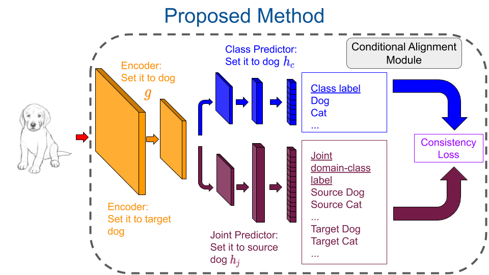

## Unsupervised Domain Adaptation via Regularized Conditional Alignment

This repository implements the algorithm proposed in Unsupervised Domain Adaptation via Regularized Conditional Alignment, ICCV (2019) using PyTorch.



## Requirements

python 3.6

numpy 1.17.2

torch 1.4.0

torchvision 0.5.0

Also, install the following packages:
```
scikit-image
googledrivedownloader
requests
PyYAML
```

## Training

You can choose the source and the target dataset and run train.py:

```python3 train.py --source_dataset=CIFAR --target_dataset=STL```

```python3 train.py --source_dataset=STL --target_dataset=CIFAR```

```python3 train.py --source_dataset=SVHN --target_dataset=MNIST```

```python3 train.py --source_dataset=MNIST --target_dataset=SVHN```

```python3 train.py --source_dataset=DIGIT --target_dataset=SVHN```

```python3 train.py --source_dataset=MNIST28 --target_dataset=MNISTM28```

## Contact
safacicek@gmail.com
